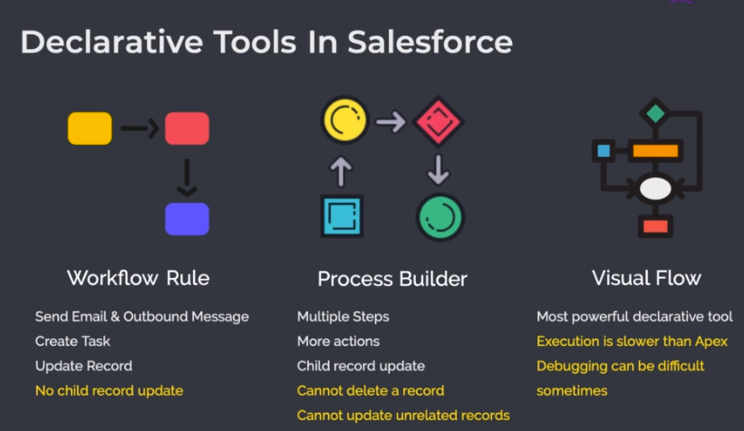

# Salesforce Notes
### Introduction
* Salesforce is CRM software.
* It helps to stream-line the process of customer acquisition, customer relationship management and interaction with company's current and potential customers.
* It has various functional capabilities for complete CRM process such as Marketing, Sales & E-Commerce, Services, Incident Management, Community, Analytics (Tableau), IoT & AI (Einstein), Apps EcoSystem(AppExchange) and Support.
---
### Architecture
#### Front-End
* Salesforce has two user interfaces:
    1. Salesforce Classic UI
    2. Salesforce Lightning UI
* Salesforce Classic UI is an old salesforce user interface which uses __VisualForce__ Pages.
* Salesforce Lighting UI was introduced in 2014 and is more modern UI that uses either __Aura Component__ or __Lighting Web Component__ for front-end development.
* Lightning Web Component is faster than Aura Component. Also, the Salesforce Classic UI is soon will be discontinued.
#### Back-End
* Salesforce uses __Oracle Database__ in the backend to store data. However, the developers cannot directly interact with the database, and rather, they interact with the __Salesforce Objects__.
* Salesforce Objects are similar to database tables where data is stored in a tabular format. The columns are known as __Fields__ and the rows of data are called __Records__.
* At the back-end, salesforce uses it's proprietary language called __Apex__ for development, which is similar to Java.
* Apex can be used to interact with the objects(database tables) using __Salesforce Object Query Language__ or __SOQL__.
* There are some declarative tools that can be used to interact with the salesforce objects such as:
    1. Workflow Rules
    2. Process Builder
    3. Visual Flows
    4. Approval Process


---
### Code Editors
1. __Salesforce Setup__: Salesforce's internal code editor. Supports Apex Classes, Apex Triggers, and VisualForce pages. Does not support Aura Component and Lightning Component.
2. __Developer Console__: Better than Salesforce Setup. Can view logs, run test classes and anonymous code. 
3. __VSCode__: Best code editor for salesforce out there.
---
### HeapSize
* There is hard limit that each Apex Program can have up to a Heap Size of 6MB. Exceeding this, can lead to an error.
---
## Apex Fundamentals

__Note: Apex is a case-insensitive language.__
* Variables cannot start and end using an underscore.

### Data-Types
* Boolean (True, False, NULL)
```apex
Boolean flag = false;
System.debug(flag);
```
* String ("Hello World")
```apex
String greeting = 'Hello World!';
System.debug(greeting);
```
* Integer (1, 123)
```apex
Integer age = 18;
System.debug(age);
```
* Long (Long Integer 64 Bit)
```apex
Long reallyLongNumber = 123456789L;
System.debug(reallyLongNumber);
```
* Decimal (Floats)
```apex
Decimal pi = 3.14;
System.debug(pi);
```
* Double (Long Floats)
```apex
Double price = 1.67632456;
System.debug(price);
```
* Date
```apex
Date tday = Date.newInstance(2023, 07, 05);
System.debug(tday);
```
* Time
```apex
Time currentTime = Time.newInstance(11, 01, 0, 0);
System.debug(currentTime);
```
* Datetime
```apex
DateTime currentDateTime = DateTime.newInstance(2023, 07, 05, 11, 01, 0);
System.debug(currentDateTime);
```
* Blob (Binary Data: Images, Files)
* ID (Record ID, Object ID, Metadata ID)
    1. 15 Digit ID: Case Sensitive ID
    2. 18 Digit ID: Case Insensitive ID

__Note: If a value is not assigned, its NULL.__

---
### String Class
```apex
String str = 'i am a string variable';
System.debug('Actual String: ' + str);
//Actual String: i am a string variable

// Capitalize String
System.debug('Capitalized String: ' + str.capitalize());
// Capitalized String: I am a string variable

// Contains
System.debug('Contains ring?: ' + str.contains('ring'));
// Contains ring?: true

// Convert To Uppercase
System.debug('Upper Case: ' + str.toUpperCase());
// Upper Case: I AM A STRING VARIABLE

// Convert To Lowercase
System.debug('Lower Case: ' + str.toLowerCase());
// Lower Case: i am a string variable

// Equals & EqualsIgnoreCase
System.debug('IsEqual to "ring"?: ' + str.equals('ring'));
// IsEqual to "ring"?: false
String name1 = 'Chirag';
String name2 = 'chirag';
System.debug('Name1 equals Name2?: ' + name1.equals(name2));
// Name1 equals Name2?: false
System.debug('Name1 equals Name2?: ' + name1.equalsIgnoreCase(name2));
// Name1 equals Name2?: true

// Remove
System.debug('Remove "ring": ' + str.remove('ring'));
// Remove "ring": i am a st variable

// Replace
System.debug('Replace "ring": ' + str.replace('ring', 'rong'));
// Replace "ring": i am a strong variable

// Split
System.debug('Split by Space: ' + str.split(' '));
// Split by Space: (i, am, a, string, variable)

// Escaping Characters
string str2 = 'My name is \'chirag\'\nI am learning Salesforce!';
System.debug(str2);
// My name is 'chirag'
// I am learning Salesforce!
```
---
### Lists (Ordered List)
```apex
// Declaration
// Empty List
List<Integer> emptyList = new List<Integer>();
System.debug(emptyList);
// ()

// Populated List
List<Integer> numbers = new List<Integer> {1, 2, 3, 4, 5};
System.debug(numbers);
// (1, 2, 3, 4, 5)

// Appending/Inserting
numbers.add(6);
numbers.add(7);
System.debug(numbers);
// (1, 2, 3, 4, 5, 6, 7)

numbers.add(1, 99);
System.debug(numbers);
// (1, 99, 2, 3, 4, 5, 6, 7)

// Indexing
System.debug(numbers[1]);
System.debug(numbers.get(1));
// 99

// Size Of The List
System.debug(numbers.size());
// 8

// Remove An Item
// Remove Excepts An Index
numbers.remove(1);
System.debug(numbers);
// (1, 2, 3, 4, 5, 6, 7)

// Update An Item
numbers[0] = -1; 
// OR numbers.set(0, -1);
System.debug(numbers);
// (-1, 2, 3, 4, 5, 6, 7)

// Remove All Items
numbers.clear();
System.debug(numbers);
// ()
```
### Sets (Unordered Lists)
```apex
// Declaration
// Empty Set
Set<Integer> emptySet = new Set<Integer>();
System.debug(emptySet);
// {}

// Populated List
Set<Integer> numbers = new Set<Integer> {1, 2, 3, 4, 5};
System.debug(numbers);
// {1, 2, 3, 4, 5}

// Adding Items To Set
// Duplicate
numbers.add(5);
numbers.add(6);
numbers.add(7);
System.debug(numbers);
// {1, 2, 3, 4, 5, 6, 7}

// Check If Set Contains An Item
System.debug(numbers.contains(7));
// True
System.debug(numbers.contains(-1));
// False

// Size Of The Set
System.debug(numbers.size());
// 7

// Remove An Item
// Remove Excepts An Item
numbers.remove(1);
System.debug(numbers);
// {2, 3, 4, 5, 6, 7}

// Check If The Set Is Empty
System.debug(numbers.isEmpty());
// False

// Remove All Items
numbers.clear();
System.debug(numbers);
// {}
System.debug(numbers.isEmpty());
// True
```
---
### Maps (K-V Pairs)
```apex
// Maps Declaration
Map<Integer, String> persons = new Map<Integer, String>();

// Add New Item In The Map
persons.put(101, 'Chirag');
System.debug(persons);
// {101=Chirag}

persons.put(102, 'Alex');
persons.put(103, 'Jane');
persons.put(104, 'Smith');
System.debug(persons);
// {101=Chirag, 102=Alex, 103=Jane, 104=Smith}

// Update Values
persons.put(104, 'Ryan');
System.debug(persons);
// {101=Chirag, 102=Alex, 103=Jane, 104=Ryan}

// Getting Values
System.debug(persons.get(101));
// Chirag

// Removing Items From The Map
persons.remove(104);
System.debug(persons);
// {101=Chirag, 102=Alex, 103=Jane}

// Getting All The Keys As Set
Set<Integer> personIds = persons.keySet();
System.debug(personIds);
// {101, 102, 103}

// Getting All The Values In The Set As List
List<String> personNames = persons.values();
System.debug(personNames);
// (Chirag, Alex, Jane)

// Check If A Key Exists
System.debug(persons.containsKey(101));
// True
System.debug(persons.containsKey(105));
// False
```
---
### Constants
```apex
// Constants Using Final
final Decimal PI = 3.14159;
// Can Be Assigned Later, But Only Once!
final Decimal GRAVITY;
GRAVITY = 9.8;
// Print
System.debug(PI);
// 3.14159
System.debug(GRAVITY);
// 9.8
```
### Operators
```apex
// Assignment Operator
Integer x = 5;

// Arithmetic Operators
// Addition
x = x + 5;
System.debug(x); // 10

// Subtraction
x = x - 5;
System.debug(x); // 5

// Multiplication
x = x * 5;
System.debug(x); // 25

// Division
x = x / 5;
System.debug(x); // 5

// Increment And Decrement Operators
x++;
System.debug(x); // 6
x--;
System.debug(x); // 5

// Addition, Multiplication, Subtraction, Division Assignment Operators
x += 5; // 10
x -= 5; // 5
x *= 5; // 25
x /= 5; // 5

// Boolean Operators
Boolean a = true;
Boolean b = false;

System.debug(a && b); // False
System.debug(a || b); // True
System.debug(!a); // False

// Equality Operators
System.debug(a == b); // False
System.debug(a == !b); // True
System.debug('Hello' == 'Hello'); // True
System.debug('Hello' == 'heLlO'); // True
System.debug('Hello' == 'World'); // False

// LT, GT, LTE, GTE
System.debug(5 < 5); // False
System.debug(5 <= 5); // True
System.debug(6 > 5); // True
System.debug(6 >= 5); // True

// Ternary Operator
Integer age = 19;
Boolean isAdult = age > 18? true : false;
System.debug('IsAdult?: ' + isAdult); // IsAdult?: True
```
__Note: == String comparison results in case insensitive character comparison (Hello == heLLo).__

---
### Data-Type Conversion
```apex
// Each Primitive Has A ValueOf Method To Convert The Data Types
String scoreStr = '23';
Integer score = Integer.valueOf(scoreStr) + 7;
System.debug(score); // 30
```
---
### If-Else
```apex
// If-Else
Integer a = 8, b = 9, c = 1;

if (a > b) {
    if (a > c) {
        System.debug('A');
    } else {
        System.debug('C');
    }
} else {
    if (b > c) {
        System.debug('B');
    } else {
        System.debug('C');
    }
}

// Example
// Leap Year Problem
Integer year = 2200;

if (Math.mod(year, 4) == 0) {
    if (Math.mod(year, 100) == 0 && Math.mod(year, 400) != 0) {    
    	System.debug('Not Leap Year');  
    } else {
    	System.debug('Leap Year');    
    }
} else {
    System.debug('Not Leap Year');
}
```
### Switch-When
```apex
// Switch-When
Integer i = 12;
switch on i {
    when 2, 4, 6, 8 {
        System.debug('Even');
    }
    when 1, 3, 5, 7, 9 {
        System.debug('Odd');
    }
    When 0 {
        System.debug('Zero');
    }
    When else {
        System.debug('I don\'t know!');
    }
}
```
### Do-While Loop
```apex
// Printing All Leap Years Between 1100 And 2000 Inclusive
Integer year = 1100;

do {
    if (Math.mod(year, 4) == 0) {
        if (Math.mod(year, 100) == 0) {    
            if (Math.mod(year, 400) == 0) {
				System.debug(year);
            }
        } else {
            System.debug(year);
        }
    }
    year++;
} while(year <= 2000);

// Fizz Buzz Program
Integer i = 0;
do {
    if (Math.mod(i, 3) == 0 && Math.mod(i, 5) == 0) {
        System.debug('fizzbuzz');
    } else if (Math.mod(i, 3) == 0) {
        System.debug('fizz');
    } else if (Math.mod(i, 5) == 0) {
        System.debug('buzz');
    }
    i++;
} while(i <= 100);
```
### While Loop
```apex
// Printing All Leap Years Between 1100 And 2000 Inclusive
Integer year = 1100;

while (year <= 2000) {
    if (Math.mod(year, 4) == 0) {
        if (Math.mod(year, 100) == 0) {    
            if (Math.mod(year, 400) == 0) {
				System.debug(year);
            }
        } else {
            System.debug(year);
        }
    }
    year++;
}
```
### For Loop
```apex
// Printing All Leap Years Between 1100 And 2000 Inclusive
Integer year = 1100;

for (Integer year = 1100; year <= 2000; year++) {
    if (Math.mod(year, 4) == 0) {
        if (Math.mod(year, 100) == 0) {    
            if (Math.mod(year, 400) == 0) {
				System.debug(year);
            }
        } else {
            System.debug(year);
        }
    }
}
```
### For-Each Loop
```apex
List<Integer> numbers = new List<Integer> {101, 102, 103, 104, 105};
    
for (Integer num : numbers) {
	System.debug(num);        
}
```
---
## Object Oriented Programming Using Apex
* Private is the default access modifier.
* Other than public, private and protected there is also __global__ modifier. Global members can be accessed across multiple namespaces.
* First static initialization blocks are called, followed by normal initialization blocks and finally the constructors.
---
## Apex Unit Testing
* Test classes and method are adorned with @isTest annotations.
* A test method must be static and void and can only be either public and protected.
```apex
public class Covid19 {
	private Integer recoveredInArea = 0;
    public static Integer recoveredInCountry = 0;
    
    public Covid19(Integer recoveredInArea) {
        if (recoveredInArea < 0) {
            recoveredInArea = 0;
        }
        this.recoveredInArea = recoveredInArea;
        recoveredInCountry += recoveredInArea;
    }
    
    public void treatPatient() {
        recoveredInArea++;
        recoveredInCountry++;
    }
    
    public Integer getTreated() {
        return recoveredInArea;
    }
}

// Test Class
@isTest
public class Covid19Test {
    
    @isTest
    public static void treatPatientTest() {
        Covid19 jaipur = new Covid19(10);
        System.assertEquals(10, jaipur.getTreated(), 'Treated count does not match');
        
        Covid19 hyd = new Covid19(112);
        System.assertEquals(112, hyd.getTreated(), 'Treated count does not match');
        
        // Check Recovered In Country
        System.assertEquals(122, Covid19.recoveredInCountry, 'Treated count does not match');
        
        jaipur.treatPatient();
        System.assert(11 == jaipur.getTreated());
        System.assert(123 == Covid19.recoveredInCountry);
    }
    
    @isTest
    public static void treatPatientTestNegative() {
    	Covid19 jaipur = new Covid19(-1);
        System.assertEquals(0, jaipur.getTreated());
    }
}
```
---
## SOQL
```SQL
-- Sample Queries
-- AND, OR
SELECT Name, Company, Email, Status FROM Lead WHERE Status = 'Closed - Converted' OR Status = 'Closed - Not Converted'

SELECT Name, Company, Email, Status FROM Lead WHERE (Status = 'Closed - Converted' OR Status = 'Closed - Not Converted') AND LeadSource = 'Web'

-- IN
SELECT Name, Company, Email, Status FROM Lead WHERE Status IN ('Closed - Converted', 'Closed - Not Converted') AND LeadSource = 'Web'

-- LIKE
SELECT Name, Company, Email, Status FROM Lead WHERE Status LIKE 'Closed - %' AND LeadSource = 'Web'

-- ORDER BY
SELECT Name, Status, CreatedDate, LeadSource, Company, Email FROM Lead ORDER BY CreatedDate DESC

-- LIMIT (Getting Last Created)
SELECT Name, Status, CreatedDate, LeadSource, Company, Email FROM Lead ORDER BY CreatedDate  DESC LIMIT 1

-- OFFSET (Getting Second Last For Example)
SELECT Name, Status, CreatedDate, LeadSource, Company, Email FROM Lead ORDER BY CreatedDate  DESC LIMIT 5 OFFSET 5

SELECT Name, Status, CreatedDate, LeadSource, Company, Email FROM Lead ORDER BY CreatedDate  DESC LIMIT 1 OFFSET 1

-- DATE TIME FORMATS
-- Date: YYYY-MM-DD
-- DateTime: 
-- YYYY-MM-DDThh:mm:ss+hh:mm
-- YYYY-MM-DDThh:mm:ss-hh:mm
-- YYYY-MM-DDThh:mm:ssZ
-- SQL Also Supports TODAY, YESTERDAY & TOMORROW Literals. 
-- Other Literals: LAST_WEEK, LAST_YEAR, NEXT_MONTH, NEXT_QUARTER, LAST_N_DAYS:n, LAST_N_YEAR:n, NEXT_N_WEEKS:n, LAST_90_DAYS, NEXT_90_DAYS, etc.

SELECT Name, Status, CreatedDate, LeadSource, Company, Email FROM Lead WHERE CreatedDate > 2023-07-10T00:00:00+0000

SELECT Name, Status, CreatedDate, LeadSource, Company, Email FROM Lead WHERE CreatedDate = TODAY

SELECT Name, Status, CreatedDate, LeadSource, Company, Email FROM Lead WHERE CreatedDate > YESTERDAY

SELECT Name, Status, CreatedDate, LeadSource, Company, Email FROM Lead WHERE CreatedDate = LAST_N_DAYS:4

-- Challenges
SELECT Name, Department, Title, Phone, Email FROM Contact WHERE Title LIKE '%VP%' AND Department = 'Finance' ORDER BY Name DESC LIMIT 3

-- Parent Child Relationship
-- Limitations:
-- 1. Only One Level Deep Relationship Is Supported
-- 2. Up to 20 Related Objects Are Supported. Below Query Uses 2 Related Objects (Contact, Opportunity)
SELECT Name, Phone, Website, (SELECT Name, Department FROM Contacts WHERE Department = 'Finance'), (SELECT Name, Amount FROM Opportunities) FROM Account

-- Child Parent Relationship
-- Up To 5 Level Deep Supported
-- Up To 55 Related Objects Are Supported
SELECT Name, Phone, Department, Account.Name, Account.Website, Account.Owner.Name FROM Contact

SELECT Account.Name, Account.Rating, Name, Department, Title, (SELECT CaseNumber, Subject FROM Cases WHERE IsClosed = False) FROM Contact Where Account.Rating = 'Hot' AND Department = 'Technology' ORDER BY Name
```
## Apex & SOQL
```apex
List<Account> accounts = [SELECT Name, Phone FROM Account];


for (Account account : accounts) {
    System.debug('Account Name: ' + account.Name + ', Account Phone: ' + account.Phone);
}

Map<Id, Account> accountsMap = new Map<Id, Account>([SELECT Name, Phone FROM Account]);

for (Account account : accountsMap.values()) {
    System.debug('Account Name: ' + account.Name + ', Account Phone: ' + account.Phone);
}

// SOQL For Relationships
List<Contact> contacts = [SELECT Account.Name, Account.Rating, Name, Department, Title, (SELECT CaseNumber, Subject FROM Cases) FROM Contact ORDER BY Name];

for (Contact contact : contacts) {
    System.debug('Contact Name: ' + contact.Name + ', Contact Department: ' + contact.Department + ', Contact Title: ' + contact.Title + ', Account Name: ' + contact.Account.Name + ', Account Rating: ' + contact.Account.Rating);
    for (Case caseObj : contact.Cases) {
        System.debug('Case Number: ' + caseObj.CaseNumber + ', Case Subject: ' + caseObj.Subject);
    }
}

// Binding Variables
List <String> accountNames = new List <String>();

accountNames.add('New Line Cinema');
accountNames.add('Sample SObject Account');
accountNames.add('Burlington Textiles Corp of America');
accountNames.add('sForce');

List <Account> accounts = [SELECT Id, Name, Rating FROM Account
                           WHERE Name IN :accountNames];

System.debug('Account Size: ' + accounts.size());
System.debug('Accounts: ' + accounts);

// Dynamic SOQL Construction
String accountClass = 'Class3';

String queryString = 'SELECT Id, Name, Phone, Rating FROM Account';

if (accountClass == 'Class1') {
    queryString += ' WHERE Rating = \'Hot\' AND Type = \'Prospect\'';
} else if (accountClass == 'Class2') {
    queryString += ' WHERE Rating = \'Warm\' AND Type = \'Other\'';
} else {
    queryString += ' WHERE Rating = \'Hot\'';
}

List <Account> accounts = Database.query(queryString);

System.debug('Accounts: ' + accounts);
System.debug('Accounts Size: ' + accounts.size());
```
---
## DML & SObject
### Insert Operation
```apex
Account account = new Account(Name = 'Chirag Software Company', Phone = '(+91) 6391199773');
account.Rating = 'Hot';
// Insert Single Account
// insert account;

List<Account> accounts = new List<Account> {
    new Account(Name = 'TCS', Phone = '9988776655', Rating = 'Warm'),
    new Account(Name = 'HCL', Phone = '9988776677', Rating = 'Cold'),    
    new Account(Name = 'InfoSys', Phone = '9988998899', Rating = 'Hot'),
    account,
    // Invalid Account
    new Account()
};

// Insert Accounts
// insert accounts;
// OR
Database.SaveResult[] saveResults = Database.insert(accounts, false);

for (Database.SaveResult saveResult : saveResults) {
    if (saveResult.isSuccess()) {
        System.debug('Row With Id: ' + saveResult.getId() + ' Successfully Inserted.');
    } else {
        for (Database.Error error : saveResult.getErrors()) {
            System.debug(error.getStatusCode() + ': ' + error.getMessage());
        }
    }
}

// Difference
// Insert Will Either Add All Objects Or None If Any Object Is Invalid
// This Behavior Can Be Controlled Using Database.insert(objects, allOrNone)
// Set AllOrNone = False To Allow Valid Objects To Insert And Disregard Invalid Objects
// Also Database.insert() Returns Result Representing Rows Which Were Successfully Inserted
```
### Simple Account Controller
```apex
public class AccountController {
    public static List<Account> insertAccounts(List<Account> accounts) {
        insert accounts;
        return accounts;
    }
    
    public static Account insertAccount(Account account) {
        insert account;
        return account;
    }
    
    public static List<Account> getAllAccounts() {
        List<Account> accounts = [SELECT Name, Phone FROM Account];
        return accounts;
    }
    
    public static void printAllAccounts() {
        List<Account> accounts = getAllAccounts();
        
        for (Account account : accounts) {
        	System.debug('Account Name: ' + account.Name + ', Account Phone: ' + account.Phone);   
        }
    }
    
    public static Integer getAccountSize() {
        return getAllAccounts().size();
    }
}
```
### Update Operation
```apex
Account account = new Account(Name = 'TCS', Phone = '9988776655');
AccountController.insertAccount(account);

List<Account> accounts = [SELECT Id, Name, Phone FROM Account WHERE Name = 'TCS' AND Phone = '9988776655'];
for (Account account : accounts) {
    account.Name = 'Tata Consultancy Services';
    account.Rating = 'Hot';
}
// Update All Accounts In List
update accounts;
// OR
// Database.update(accounts, true);
```
### Delete Operation
```apex
// Delete Operation
List<Account> accounts = [SELECT Id FROM Account WHERE Name = 'Tata Consultancy Services'];
delete accounts;
// OR
// Database.delete(account);
```
### Un-Delete Operation
```apex
// Get Deleted Rows
List<Account> deletedAccounts = [SELECT Id, Name, Phone FROM Account WHERE isDeleted = true AND Name = 'Tata Consultancy Services' LIMIT 1 OFFSET 1 ALL ROWS];
System.debug(deletedAccounts);
// Undelete Accounts
undelete deletedAccounts;
```
### SObjects (Parent Class Of All Objects)
```apex
List<SObject> accounts = [SELECT Id, Name, Phone FROM Account];

for (SObject account : accounts) {
    System.debug('Account Name: ' + (String)account.get('Name') + ', Account Phone: ' + (String)account.get('Phone'));
}

List<SObject> contacts = [SELECT Name, Email, Account.Name FROM Contact];
// Access Parent From Child
// Using SObject.getSObject('Parent Relationship').get('Field')
for (SObject contact : contacts) {
    System.debug('Contact Name: ' + contact.get('Name') + ', Contact Email: ' + contact.get('Email') + ', Account Name: ' + contact.getSObject('Account').get('Name'));
}

// Access Child From Parent
List<SObject> accounts = [SELECT Name, Website, (SELECT Name, Email FROM Contacts) FROM Account];
for (SObject account : accounts) {
    System.debug('Account Name: ' + account.get('Name') + ', Account Website: ' + account.get('Website'));
    SObject[] contacts = account.getSObjects('Contacts');
    if (contacts != null) {
    	for (SObject contact : contacts) {
        	System.debug('Contact Name: ' + contact.get('Name') + ', Contact Email: ' + contact.get('Email'));
    	}
    }
}

// Create New SObject Instance
SObject account = (SObject)Type.forName('Account').newInstance();

// Put Fields
account.put('Name', 'Chirag Gaming Company');
account.put('Phone', '9988776677');

insert account;
```
### Challenge
```apex
List <Account> toDeleteAcc = [SELECT Id FROM Account WHERE Name = 'WingNut Films'];
delete toDeleteAcc;
List <Opportunity> toDeleteOpp = [SELECT Id FROM Opportunity WHERE Name = 'Lord Of The Rings'];
delete toDeleteOpp;

// Create New Account

// Account account = new Account(Name = 'WingNut Films', Rating = 'Warm');
SObject account = (SObject)Type.forName('Account').newInstance();
account.put('Name', 'WingNut Films');
account.put('Rating', 'Warm');
// Insert New Account
insert account;

// Opportunity opportunity = new Opportunity(Name = 'Lord Of The Rings', StageName = 'Qualification', CloseDate = Date.today(), AccountId = account.Id);
SObject opportunity = (SObject)Type.forName('Opportunity').newInstance();
opportunity.put('Name', 'Lord Of The Rings');
opportunity.put('StageName', 'Qualification');
opportunity.put('CloseDate', Date.today());
opportunity.put('AccountId', account.get('Id'));
// Insert Opportunity
insert opportunity;

// Update Account Name
account.put('Name', 'New Line Cinema');
// account.Name = 'New Line Cinema';
update account;

// Update Opportunity Stage
opportunity.put('StageName', 'Closed-Won');
// opportunity.StageName = 'Closed-Won';
update opportunity;

// Delete And Undelete
// Opportunity toDelete = [SELECT Id FROM Opportunity WHERE Name = 'Lord Of The Rings'];
// delete toDelete;

// Undelete
// Opportunity deletedOp = [SELECT Id FROM Opportunity WHERE Name = 'Lord Of The Rings' AND isDeleted = true LIMIT 1 OFFSET 1 ALL ROWS];
// undelete deletedOp;

// SELECT Id, Name, Account.Name, StageName, CloseDate FROM Opportunity

// SELECT Id, Name, Rating FROM Account
```
## Code Bulkification
```apex
// Opportunity Controller Class
public class OpportunityController {
	public static void updateProfile(List<Id> opportunityIds) {
		// Query All At Once
		List<Opportunity> opportunities = [SELECT Id, Amount, Profile__c FROM Opportunity WHERE Id IN :opportunityIds];
		for (Opportunity opportunity : opportunities) {
			// Avoid Adding Queries In Loops
			if (opportunity.Amount == null) {
				opportunity.Profile__c = '';
			} else if (opportunity.Amount < 10000) {
				opportunity.Profile__c = 'Low';
			} else if (opportunity.Amount > 50000) {
				opportunity.Profile__c = 'High';
			} else {
				opportunity.Profile__c = 'Medium';
			}
		}
		// Update All At Once
		update opportunities;
	}
}

// Execute Anonymous
List<Id> opportunityIds = new List<Id>();
for (Opportunity opportunity : [SELECT Id FROM Opportunity]) {
    opportunityIds.add(opportunity.Id);
}

System.debug(opportunityIds);

OpportunityController.updateProfile(opportunityIds);
```
### Avoid Hitting Limits By Monitoring Current Usage
```apex
// Avoid Governor Limits
List <Account> accounts = [SELECT Id, Type, Name, ParentId FROM Account];

while (true) {
	if (Limits.getHeapSize() * 2 >= Limits.getLimitHeapSize()) {
		break;
	}
	List<Account> duplicateAccounts = accounts;
	accounts.addAll(duplicateAccounts);
}

System.debug(accounts.size());
```
### Challenges
```apex
public static void updateAvgCaseResolutionDays(List<Id> accountIds) {
	// Get All Accounts And Associated Cases Using Parent Child Relationship Query
	List<Account> accounts = [SELECT Id, (SELECT CreatedDate, ClosedDate FROM Cases WHERE IsClosed = true) FROM Account WHERE Id IN :accountIds AND Id IN (SELECT AccountId FROM Case)];
	// For Each Account
	for (Account account : accounts) {
		Integer totalCases = 0, totalDays = 0;
		// For All Cases In Each Account Calculate Total Cases And TotalDays
		for (Case caseObj : account.Cases) {
			totalCases++;
			totalDays += caseObj.CreatedDate.date().daysBetween(caseObj.ClosedDate.date());
		}
		// Find Average
		Decimal resolutionDays;
		if (totalCases > 0) {
			resolutionDays = totalDays / totalCases;
		}
		// Update Average Case Resolution Days Field Of The Account
		account.Avg_Case_Resolution_Days__c = resolutionDays;
	}
	// Commit The Changes In Database
	update accounts;
}
```